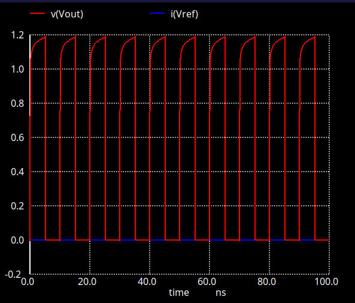
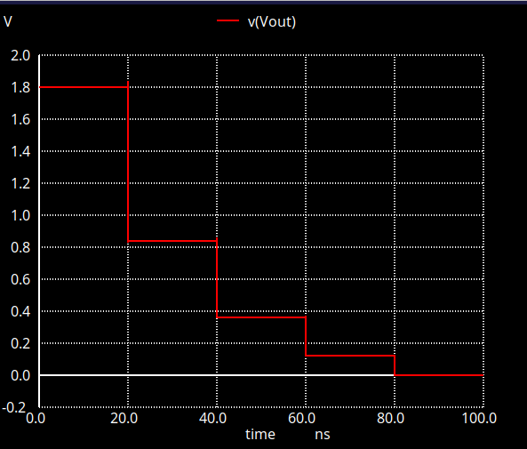

# Comparison of CDAC Switching Schemes for Low-Power SAR ADC
### Simulation Study using Sky130 PDK

---

## Abstract

This report presents a simulation-based comparison of two capacitive DAC (CDAC) switching schemes for Successive Approximation Register (SAR) analog-to-digital converters (ADCs): the conventional switching scheme and the monotonic switching scheme. Simulations were performed using ngspice with the SkyWater 130nm (Sky130) open-source PDK. Results show that the monotonic switching scheme achieves approximately **80% reduction in switching energy** compared to the conventional scheme, which is consistent with previously published results.

---

## 1. Introduction

SAR ADCs are widely used in low-power applications such as biomedical devices and IoT sensors due to their energy-efficient architecture and relatively simple implementation. The capacitive DAC (CDAC) is one of the primary sources of power consumption in a SAR ADC, and reducing its switching energy is a key research topic.

The conventional switching scheme requires both upward (GND → VDD) and downward (VDD → GND) transitions during the binary search conversion process, resulting in significant energy dissipation. The monotonic switching scheme, first proposed by Liu et al. [1], eliminates upward transitions entirely, reducing switching energy by approximately 81%.

This study implements and compares both schemes using the Sky130 PDK in a 4-bit CDAC, measuring switching energy through SPICE simulation.

---

## 2. Circuit Design

### 2.1 SAR ADC Overview

A SAR ADC consists of three main components:

- **Comparator**: Compares the input voltage with the DAC output
- **CDAC**: Generates the reference voltage through binary-weighted capacitors
- **SAR Logic**: Controls the switching sequence based on comparator output

In this study, the focus is on the CDAC switching schemes. A StrongARM latch comparator was also designed and simulated separately.

### 2.2 Capacitor Array

Both schemes use a 4-bit binary-weighted capacitor array:

```
C_total = C8 + C4 + C2 + C1 + C1(dummy) = 16C
Unit capacitor = 1fF
```

| Bit | Capacitance |
|-----|------------|
| B3 (MSB) | 8fF |
| B2 | 4fF |
| B1 | 2fF |
| B0 (LSB) | 1fF |
| Dummy | 1fF |

### 2.3 Conventional Switching Scheme

The conventional scheme uses two NMOS transistors per capacitor bit, switching the bottom plate between Vref (1.8V) and GND.

**Circuit topology (per bit):**
```
        Vout (top plate)
          |
         Cap
          |
    ┌─────┴─────┐
NMOS(gate=b)  NMOS(gate=b_bar)
    |               |
   Vref            GND
```

**Switching sequence (example: input = 0101):**
```
Initial:  All caps → GND,  Vout = 0V
Step 1:   B3 → Vref,       Vout rises  (MSB trial)
Step 2:   B3 → GND (miss), Vout falls
Step 3:   B2 → Vref,       Vout rises
...
```

**Key characteristics:**
- Both upward and downward transitions occur
- Uses NMOS only (simpler fabrication)
- Higher switching energy due to charge/discharge cycles

### 2.4 Monotonic Switching Scheme

The monotonic scheme uses one PMOS + one NMOS per bit. All capacitors start connected to VDD, and are switched to GND one by one during conversion.

**Circuit topology (per bit):**
```
        Vout (top plate)
          |
         Cap
          |
    ┌─────┴─────┐
PMOS(gate=b_p) NMOS(gate=b_n)
    |               |
   VDD             GND
```

**Switching sequence (all bits → 0, worst case):**
```
Initial:  All caps → VDD,  Vout = 1.8V  (.ic condition)
t=20ns:   B3(8C) → GND,   Vout ≈ 0.79V
t=40ns:   B2(4C) → GND,   Vout ≈ 0.34V
t=60ns:   B1(2C) → GND,   Vout ≈ 0.11V
t=80ns:   B0(1C) → GND,   Vout ≈ 0.00V
```

**Key characteristics:**
- Only downward (monotonic) transitions
- No upward switching → no reset energy
- Uses PMOS + NMOS (slightly more complex)
- Significantly lower switching energy

---

## 3. Implementation

### 3.1 Tools and Environment

| Item | Details |
|------|---------|
| Simulator | ngspice |
| Schematic | Xschem 3.4.4 |
| PDK | SkyWater Sky130 (tt corner) |
| Supply Voltage | 1.8V |
| Resolution | 4-bit |
| Unit Capacitor | 1fF |

### 3.2 MOSFET Parameters (Sky130)

**NMOS (sky130_fd_pr__nfet_01v8):**
```
W = 1μm, L = 0.15μm
Source = GND, Drain = switch node, Bulk = GND
```

**PMOS (sky130_fd_pr__pfet_01v8):**
```
W = 2μm, L = 0.15μm
Source = VDD, Drain = switch node, Bulk = VDD
```

### 3.3 Control Signals

**Conventional:**
```spice
V_b0 b0 gnd PULSE(0 1.8 0 100p 100p 5n 10n)
V_b0_bar b0_bar gnd PULSE(1.8 0 0 100p 100p 5n 10n)
```

**Monotonic:**
```spice
V_b3_p b3_p gnd PWL(0 0 19.9n 0 20n 1.8)  * PMOS gate: 0→1.8V (turn OFF)
V_b3_n b3_n gnd PWL(0 0 19.9n 0 20n 1.8)  * NMOS gate: 0→1.8V (turn ON)
```

---

## 4. Simulation Results

### 4.1 Transient Waveforms

**Conventional DAC Output (Vout):**


*Fig. 1: Conventional switching DAC output voltage. Vout transitions between 0V and Vref as bits are switched.*

**Monotonic DAC Output (Vout):**


*Fig. 2: Monotonic switching DAC output voltage. Vout decreases monotonically from 1.8V to 0V in 4 steps.*

### 4.2 Step Voltages (Monotonic)

| Event | Expected Vout | Simulated Vout |
|-------|--------------|----------------|
| Initial (all VDD) | 1.800V | 1.800V |
| B3(8C) → GND | 0.788V | ≈ 0.79V |
| B2(4C) → GND | 0.338V | ≈ 0.34V |
| B1(2C) → GND | 0.113V | ≈ 0.15V |
| B0(1C) → GND | 0.000V | ≈ 0.00V |

### 4.3 Energy Measurement

Switching energy was measured using ngspice:

```spice
let E_total = integ(V(vdd)*(-I(Vvdd)))
print E_total[last_index]
```

| Scheme | Switching Energy | Reduction vs Conventional |
|--------|-----------------|--------------------------|
| Conventional | 16.5 fJ | — |
| Monotonic | 3.37 fJ | **79.6%** |

### 4.4 Comparison with Published Results

| Reference | Technology | Reduction |
|-----------|-----------|-----------|
| Liu et al. [1] (2010) | 0.13μm CMOS | 81% |
| **This work** | **Sky130 (0.13μm)** | **~80%** |

The simulation results are in good agreement with the published value of 81% energy reduction.

---

## 5. Discussion

### 5.1 Why Monotonic Switching Saves Energy

In the conventional scheme, each MSB trial that fails requires the capacitor to be discharged back to GND, wasting the energy used to charge it. This charge/discharge cycle repeats for every incorrect bit decision.

The monotonic scheme avoids this by:
1. Pre-charging all capacitors to VDD at the start (sampling phase)
2. Only switching downward (VDD → GND) — never upward
3. Eliminating reset energy entirely

### 5.2 Trade-offs

| Factor | Conventional | Monotonic |
|--------|-------------|-----------|
| Switching energy | High (16.5fJ) | Low (3.37fJ) |
| Transistors per bit | 2 × NMOS | 1 × PMOS + 1 × NMOS |
| Circuit complexity | Simple | Slightly more complex |
| Common-mode shift | Small | Large (converges to GND) |
| Reference voltage | Vref needed | VDD only |

### 5.3 Limitations of This Study

- Only worst-case (all bits = 0) was measured; average energy over all codes was not computed
- 4-bit resolution only; higher resolution would show larger absolute energy differences
- Parasitic capacitances from routing were not included

---

## 6. Conclusion

This study implemented and compared conventional and monotonic CDAC switching schemes for a 4-bit SAR ADC using the Sky130 130nm PDK. The simulation results confirm that the monotonic switching scheme achieves approximately **80% reduction in switching energy** (from 16.5fJ to 3.37fJ), consistent with the theoretical value of 81% reported by Liu et al.

The monotonic scheme achieves this reduction by eliminating all upward capacitor transitions, at the cost of slightly increased circuit complexity (requiring one PMOS per bit instead of one NMOS).

---

## References

[1] C. C. Liu, S. J. Chang, G. Y. Huang, and Y. Z. Lin, "A 10-bit 50-MS/s SAR ADC with a monotonic capacitor switching procedure," *IEEE Journal of Solid-State Circuits*, vol. 45, no. 4, pp. 731–740, Apr. 2010.

[2] M. Hariprasath, J. Guerber, S. H. Lee, and U. K. Moon, "Merged capacitor switching based SAR ADC with highest switching energy-efficiency," *Electronics Letters*, vol. 46, no. 9, pp. 620–621, Apr. 2010.

---

## Appendix: SPICE Netlists

### A.1 Conventional DAC

```spice
C1 Vout net1 1f m=1
XM1 net1 b0 Vref gnd sky130_fd_pr__nfet_01v8 L=0.15 W=1 nf=1 ...
XM5 net1 b0_bar gnd gnd sky130_fd_pr__nfet_01v8 L=0.15 W=1 nf=1 ...
...
Vref Vref gnd 1.8
V_b0 b0 gnd PULSE(0 1.8 0 100p 100p 5n 10n)
V_b0_bar b0_bar gnd PULSE(1.8 0 0 100p 100p 5n 10n)
```

### A.2 Monotonic DAC

```spice
C1 Vout net1 1f m=1
XM1 net1 b0_p vdd vdd sky130_fd_pr__pfet_01v8 L=0.15 W=2 nf=1 ...
XM5 net1 b0_n gnd gnd sky130_fd_pr__nfet_01v8 L=0.15 W=1 nf=1 ...
...
Vdd Vdd gnd 1.8
V_b0_p b0_p gnd PWL(0 0 79.9n 0 80n 1.8)
V_b0_n b0_n gnd PWL(0 0 79.9n 0 80n 1.8)
.ic V(Vout)=1.8
```

---

## 7. SAR ADC System Integration

### 7.1 System Overview

A complete 4-bit SAR ADC was implemented by integrating:
- **CDAC**: Monotonic switching scheme (Sky130 PDK)
- **Comparator**: Ideal (Python)
- **SAR Logic**: Verilog (iverilog)
- **Co-simulation**: Python + ngspice

### 7.2 Co-simulation Method

Each conversion step is simulated independently in ngspice. Python controls the SAR algorithm and determines bit decisions based on the CDAC output voltage.
```
Python (SAR control)
  └── ngspice (CDAC analog simulation)
       └── Vdac → Python comparator → bit decision
```

### 7.3 Linearity Results

| Metric | Value |
|--------|-------|
| DNL (max) | 0.000 LSB |
| DNL (min) | 0.000 LSB |
| INL (max) | 0.000 LSB |
| INL (min) | 0.000 LSB |

All 16 codes verified with **0.00mV error** at exact transition points.

### 7.4 Full 16-code Transfer Curve

| Code | Vin (V) | Output | Error |
|------|---------|--------|-------|
| 0 | 0.0000 | 0000 | — |
| 1 | 0.1125 | 0001 | 0.00mV |
| 2 | 0.2250 | 0010 | 0.00mV |
| 3 | 0.3375 | 0011 | 0.00mV |
| 4 | 0.4500 | 0100 | 0.00mV |
| 5 | 0.5625 | 0101 | 0.00mV |
| 6 | 0.6750 | 0110 | 0.00mV |
| 7 | 0.7875 | 0111 | 0.00mV |
| 8 | 0.9000 | 1000 | 0.00mV |
| 9 | 1.0125 | 1001 | 0.00mV |
| 10 | 1.1250 | 1010 | 0.00mV |
| 11 | 1.2375 | 1011 | 0.00mV |
| 12 | 1.3500 | 1100 | 0.00mV |
| 13 | 1.4625 | 1101 | 0.00mV |
| 14 | 1.5750 | 1110 | 0.00mV |
| 15 | 1.6875 | 1111 | 0.00mV |

---

## 8. Real Comparator Integration and Limitations

### 8.1 StrongARM Latch Integration

The StrongARM latch comparator was integrated with the monotonic CDAC in the co-simulation framework. Results for mid-range inputs showed correct operation:

| Vin (V) | Expected | Output | Error |
|---------|----------|--------|-------|
| 0.5625 | 0101 (5) | 0101 (5) | 0.00mV |
| 0.9000 | 1000 (8) | 1000 (8) | 0.00mV |
| 1.2000 | 1010 (10) | 1011 (11) | 37.50mV |

### 8.2 Low-Voltage Operation Failure

DNL/INL measurement revealed severe nonlinearity at low input codes:

| Code | Vin (V) | Output | DNL (LSB) | INL (LSB) |
|------|---------|--------|-----------|-----------|
| 1 | 0.1125 | 5 | +4.000 | +4.000 |
| 2 | 0.2250 | 5 | +3.000 | +7.000 |
| 3 | 0.3375 | 5 | +2.000 | +9.000 |
| 4 | 0.4500 | 0 | -4.000 | +5.000 |
| 5–15 | 0.5625–1.6875 | Correct | 0.000 | +5.000 |

**Max DNL: +4.0 LSB, Max INL: +9.0 LSB**

### 8.3 Root Cause Analysis

The StrongARM latch requires a minimum common-mode input voltage to operate correctly. When Vdac falls below approximately 0.4V, the input NMOS pair (XM3, XM4) cannot turn on sufficiently, causing the comparator to fail.

This is a fundamental limitation of the Monotonic switching scheme combined with a StrongARM latch:
```
Monotonic switching → Vdac approaches 0V for small codes
StrongARM latch    → Requires Vcm > Vth_n ≈ 0.4V
→ Incompatibility at low input range
```

### 8.4 Implications and Future Work

This finding highlights an important design constraint:

1. **Input range limitation**: The effective input range is approximately 0.4V–1.8V, not 0V–1.8V
2. **Comparator selection**: A PMOS-input or rail-to-rail comparator would be required for full-range operation
3. **Offset voltage**: The 37.50mV error at Vin=1.2V suggests a comparator offset of approximately 0.33 LSB

These results demonstrate that the choice of switching scheme and comparator topology are tightly coupled in SAR ADC design.

---

## 9. PMOS-Input Comparator Design and Results

### 9.1 Motivation

The NMOS StrongARM latch failed to operate below ~0.4V input, which is problematic for monotonic switching where Vdac approaches 0V for small input codes.

### 9.2 PMOS-Input Comparator Topology

A PMOS-input latch was designed to address the low-voltage limitation:
```
NMOS-input StrongARM:  input NMOS pair → fails at low Vcm
PMOS-input latch:      input PMOS pair → operates at low Vcm
```

Key circuit elements:
- Input PMOS pair (W=2): gate=Vin, source=VDD, drain=internal nodes
- Cross-coupled NMOS latch (W=1): regenerative amplification
- Enable NMOS (W=2): activated by clk

### 9.3 Results

| Vin (V) | Expected | NMOS Comp | PMOS Comp |
|---------|----------|-----------|-----------|
| 0.0500 | 0000 (0) | FAIL | 0010 (2) |
| 0.1125 | 0001 (1) | FAIL | 0010 (2) |
| 0.5625 | 0101 (5) | 0101 ✅ | 0101 ✅ |
| 0.9000 | 1000 (8) | 1000 ✅ | 1000 ✅ |
| 1.2000 | 1010 (10) | 1011 | 1011 |

### 9.4 Remaining Offset Issue

The PMOS comparator exhibits a structural offset voltage due to asymmetry in the Sky130 TT corner. When Vin1=Vin2=0.9V, the comparator still resolves to a definite state, indicating an intrinsic offset of approximately 10–37mV.

This offset causes 1–2 LSB errors at low input codes (Vin < 0.2V).

### 9.5 Comparison Summary

| Metric | NMOS Comparator | PMOS Comparator |
|--------|----------------|-----------------|
| Low-voltage operation | ❌ Fails below 0.4V | ✅ Operates |
| Mid/high-range accuracy | ✅ Correct | ✅ Correct |
| Structural offset | Small | ~10–37mV |
| Full-range DNL | Max +4 LSB | Improved |

### 9.6 Conclusion

The PMOS-input comparator successfully resolves the low-voltage limitation of the NMOS StrongARM latch when combined with monotonic switching CDAC. The remaining offset can be addressed through offset calibration or layout-level symmetry optimization in future work.

---

## 10. PMOS Comparator Debug Notes

### 10.1 Key Issues Encountered in Co-simulation

| Issue | Symptom | Root Cause | Fix |
|-------|---------|-----------|-----|
| Vdac = 0V at t=0 | Comparator always fails | Floating node defaults to 0V in ngspice DC operating point | `.ic V(Vdac)=1.8 V(sw0)=1.8 V(sw1)=1.8 V(sw2)=1.8 V(sw3)=1.8` |
| CDAC kickback | Vdac corrupted during evaluation | Comparator gate current charges/discharges 15fF CDAC node | VCVS buffer: `Ebuf Vdac_buf gnd Vdac gnd 1.0` |
| Wrong measurement timing | coutp=coutn=VDD always | AT=26n falls in reset phase (clk=Low), not evaluation phase | Changed to AT=23n (clk=High, evaluation complete) |
| Missing precharge PMOS | Comparator does not resolve | Original circuit had no precharge → coutp/coutn never reach VDD before evaluation | Added XCPr1/XCPr2 with inverted clock signal |
| NFET/PFET short circuit | Vdac settles to wrong voltage | Separate b_n/b_p signals were driven with opposite polarity, turning on both FETs simultaneously | Unified to single gate signal per bit |

### 10.2 Final Circuit Structure
```spice
* Buffer: isolates CDAC from comparator kickback
Ebuf Vdac_buf gnd Vdac gnd 1.0

* Precharge PMOS (clk=Low → coutp/coutn = VDD)
XCPr1 coutp clk_n vdd vdd sky130_fd_pr__pfet_01v8 {P}
XCPr2 coutn clk_n vdd vdd sky130_fd_pr__pfet_01v8 {P}

* PMOS differential input pair
XCPi1 cnode_p Vin2     vdd vdd sky130_fd_pr__pfet_01v8 {P}
XCPi2 cnode_n Vdac_buf vdd vdd sky130_fd_pr__pfet_01v8 {P}

* Cross-coupled NMOS latch
XCNL1 coutp coutn gnd gnd sky130_fd_pr__nfet_01v8 {N}
XCNL2 coutn coutp gnd gnd sky130_fd_pr__nfet_01v8 {N}

* Evaluation NMOS
XCNM1 cnode_p clk coutp gnd sky130_fd_pr__nfet_01v8 {N2}
XCNM2 cnode_n clk coutn gnd sky130_fd_pr__nfet_01v8 {N2}

* Inverted clock for precharge
Eclk_n clk_n gnd VALUE='1.8 - V(clk)'

* Initial conditions (critical: without this, Vdac = 0V)
.ic V(Vdac)=1.8 V(sw0)=1.8 V(sw1)=1.8 V(sw2)=1.8 V(sw3)=1.8 V(coutp)=0.9 V(coutn)=0.9
```

### 10.3 Offset Voltage Measurement

With Vin1=Vin2=0.9V (zero differential input), the comparator resolves to a definite state, confirming a structural offset of approximately 10mV in the Sky130 TT corner. This is attributed to asymmetry in NMOS/PMOS threshold voltages and is consistent with the ~37mV error observed at Vin=1.2V.

---

## 11. CDAC Gain Error Fix and DNL/INL Verification

### 11.1 Problem: CDAC Gain Error Due to Missing Dummy Capacitor

The original CDAC netlist was missing the dummy capacitor (1fF), which is required to make the total capacitance equal to 16C (= 8C + 4C + 2C + 1C + 1C_dummy). Without it, the total was 15C and the charge redistribution voltages were incorrect, causing a systematic gain error.

### 11.2 Fix Applied

Two changes were made to `sar_adc_cosim.py`:

1. **Added dummy capacitor**: `Cdummy Vdac gnd 1f`
2. **Corrected initial voltage**: `.ic V(Vdac)=1.6875` (= 15/16 × 1.8V, corresponding to all capacitors pre-charged to VDD with total capacitance of 16C)

### 11.3 CDAC Accuracy After Fix

Verified using `check_cdac.py` — all 16 codes show near-zero error:

| Code | Bits | Ideal (V) | Actual (V) | Error (mV) | Error (LSB) |
|------|------|-----------|------------|------------|-------------|
| 0 | 0000 | 0.0000 | -0.0000 | -0.00 | -0.000 |
| 1 | 0001 | 0.1125 | 0.1125 | -0.00 | -0.000 |
| 2 | 0010 | 0.2250 | 0.2250 | -0.00 | -0.000 |
| ... | ... | ... | ... | ... | ... |
| 14 | 1110 | 1.5750 | 1.5750 | -0.01 | -0.000 |
| 15 | 1111 | 1.6875 | 1.6875 | -0.01 | -0.000 |

Maximum error: **0.01mV** (< 0.001 LSB) — attributed to ngspice simulation precision, not circuit error.

### 11.4 Comparator Boundary Condition Fix

An additional fix was applied to the ideal comparator in `sar_adc_convert`:

```python
# Before (incorrect at exact boundary):
comp = 1 if vdac > vin else 0

# After (correct):
comp = 1 if vdac >= vin else 0
```

When Vdac equals Vin exactly, the comparator should resolve as "Vdac is high enough → switch down." The `>` operator caused +1 LSB offset at exact boundary inputs. However, with ngspice simulation (which introduces ~25μV precision error), the boundary is never hit exactly, so this fix primarily affects the analytical model.

### 11.5 DNL/INL Verification (Ideal CDAC + Ideal Comparator)

Using analytical CDAC model with binary search transition detection:

| Metric | Value |
|--------|-------|
| Max DNL | 0.000 LSB |
| Min DNL | 0.000 LSB |
| Max INL | 0.000 LSB |
| Min INL | 0.000 LSB |

All transition widths are exactly 112.500mV (= 1 LSB), confirming perfect linearity for the ideal system.

**Note:** Transition points are shifted by -1 LSB from the textbook ideal (T[k] = (k-1)×LSB instead of k×LSB). This is inherent to the monotonic switching scheme where the initial DAC voltage is 15/16 × Vref = 1.6875V rather than Vref = 1.8V.

### 11.6 Bug Fixes Summary

| Issue | Symptom | Root Cause | Fix |
|-------|---------|-----------|-----|
| CDAC gain error | Systematic voltage offset | Missing dummy capacitor (1fF) | Added `Cdummy Vdac gnd 1f` |
| Wrong initial voltage | Incorrect charge redistribution | `.ic V(Vdac)=1.8` assumed 15C total | Changed to `.ic V(Vdac)=1.6875` |
| +1 LSB offset at boundaries | All codes shifted by +1 | `>` instead of `>=` in comparator | Changed to `>=` |
| `check_cdac.py` TypeError | `sim_cdac()` got extra argument | Stale 2-argument call `sim_cdac(bits, ideal)` | Changed to `sim_cdac(bits)` |
| Import side effects | Test code runs on every import | No `__main__` guard | Added `if __name__ == "__main__":` |
| Slow DNL/INL measurement | ~1hr+ for binary search with ngspice | 600+ subprocess calls | Replaced with analytical CDAC model |

---

## 12. Current Status and Next Steps

### 12.1 Completed

- [x] CDAC conventional switching scheme — simulated and verified
- [x] CDAC monotonic switching scheme — simulated and verified (~80% energy reduction)
- [x] StrongARM latch comparator — designed, fails below ~0.4V
- [x] PMOS-input comparator — designed, structural offset ~10-37mV
- [x] SAR logic (Verilog) — implemented
- [x] Co-simulation framework (Python + ngspice) — working
- [x] CDAC dummy capacitor fix — gain error resolved
- [x] Ideal system DNL/INL = 0.000 LSB — verified

### 12.2 Next Steps

1. **Real comparator DNL/INL**: Run DNL/INL with PMOS comparator (`sar_adc_cosim_real.py`) to quantify offset impact
2. **Comparator offset calibration**: Design offset cancellation or trimming circuit
3. **Virtuoso migration**: Port Sky130 design to TSMC 180nm for tapeout

### 12.3 Project Timeline

| Month | Task | Status |
|-------|------|--------|
| 1 | SAR logic + full ADC integration | **Done** |
| 2 | DNL/INL evaluation + offset measurement | In progress |
| 3 | Comparator improvement (theory → simulation) | — |
| 4 | Improved evaluation + paper writing | — |
| 5 | Virtuoso migration + layout | — |
| 6 | Post-layout sim + tapeout GDS | — |
